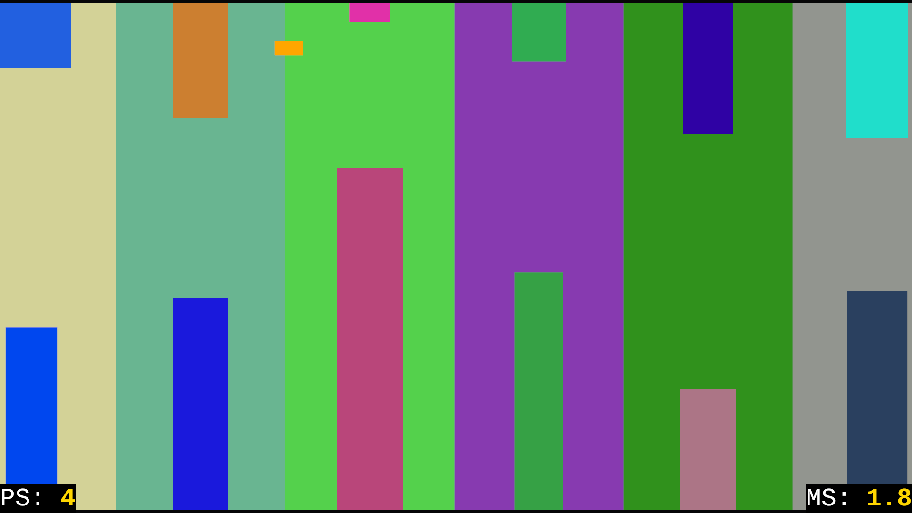
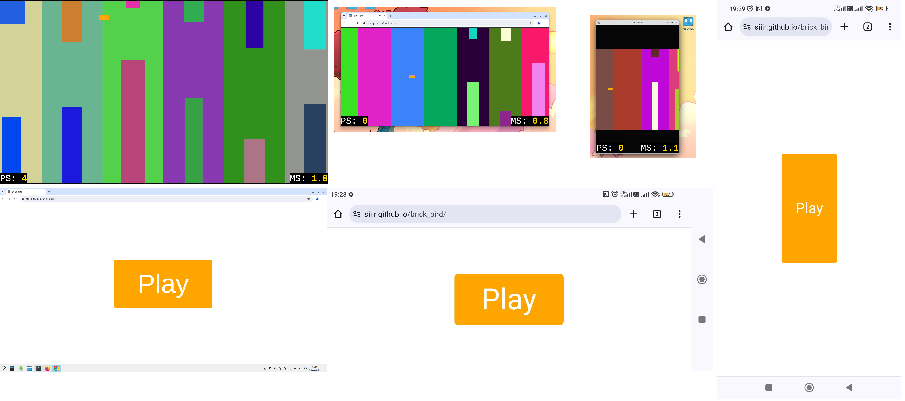

# brick_bird – a colorful Flappy Bird clone written in Rust


## Evade obstackles ...



## ... in different environments




## How to play?

### Where to Play?
- **Online**: Play directly in your browser [here](https://siiir.github.io/brick_bird/). **Note:** Chrome is highly recommended due to better performance.
- **Desktop**: [Download the desktop version](https://github.com/Siiir/brick_bird/releases/). **Note:** Ensure the game executable is next to the asset folder before running.

### Objective
- Aim to achieve the highest **PS** (Passed Sectors count) possible.

### Game difficulty
Marked by **MS** (Movement Speed) variable.
Increases with each passed sector as simulation accelerates.

### Tutorial
You fly automatically.  
To avoid obstackles jump.  
**Tip**: Do it interchangably using all functional buttons.  
#### Jump with
1. Keyboard – click `<space>` button.  
2. Mouse – click `<left button>`.  
3. Touch screen – touch anywhere on the game viewport.  


## Build & run the app

### Desktop version
#### Quick start
1. Go to the folder where you want to install (put) the game.  
2. Use the following bash commands:  
    ```bash
    git clone github.com/siiir/brick_bird
    cd brick_bird
    git switch stable
    cargo build --release
    ```
    These obviously requires having these bash commands installed.  
3. When you want to **run the game**:  
    1. go to instalation folder  
    2. enter command `cargo run -r`  
#### Better installation (optimizations, click-to-run)
1. Ask AI model for help. Show it this README.md file & "Cargo.toml" file. It should help you to compile this project with best optimizations. These improvements are neither obvious nor necessary for everyone.  
2. See build profiles in "Cargo.toml".  

### Browser version
1. Go to the folder where you want to install (put) the game.  
2. Use the following bash commands:  
    ```bash
    git clone github.com/siiir/brick_bird
    cd brick_bird
    git switch web-stable
    ```
    These obviously requires having these bash commands installed.  
3. When you want to **run the game**:  
    1. Serve the game using a static file server  
        **Using** Node.js http-server
        ```bash
        http-server . -p 8000
        ```
        **Or** using Python3
        ```bash
        python -m http.server 8000
        ```
    2. Access the game in a browser at `http://localhost:8000`.

## How this educational project stands out?
### Own physic engine.
{collisions, gravity, acceleration, turbulence} have been coded from scrath using **math**.  
### Parallel execution
Will utilize or your cores, when running outside of browser.  
ECS design allows this game to scale with number of CPUs.
### Professional and Unique
- Highly modular and scalable architecture.
- Leverages unique capabilities of the Rust programming language.
### Pure Coding
- Developed entirely through coding without the use of any graphical editors.
